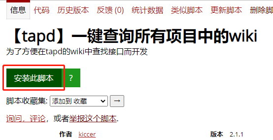

<h1 align="center">tapd-search-wiki</h1>

> 项目发布于 [greasyfork](https://greasyfork.org/zh-CN/scripts/418789-tapd-%E4%B8%80%E9%94%AE%E6%9F%A5%E8%AF%A2%E6%89%80%E6%9C%89%E9%A1%B9%E7%9B%AE%E4%B8%AD%E7%9A%84wiki)，代码托管于 [GitHub](https://github.com/kiccer/tapd-search-wiki)。

 

    

 

### 安装
1. 安装 `chrome` 扩展插件 [`tampermonkey`](https://chrome.google.com/webstore/detail/tampermonkey/dhdgffkkebhmkfjojejmpbldmpobfkfo?hl=zh-CN)(需科学上网)
    - 实在没有办法就下载本项目提供的老版 [`tampermonkey (v4.9)`](./resources/Tampermonkey_v4.9/Tampermonkey_v4.9.crx)
1. 安装最新版 [tapd-search-wiki](https://greasyfork.org/zh-CN/scripts/418789-tapd-%E4%B8%80%E9%94%AE%E6%9F%A5%E8%AF%A2%E6%89%80%E6%9C%89%E9%A1%B9%E7%9B%AE%E4%B8%AD%E7%9A%84wiki) 插件

### 描述

使用此脚本需要安装 `chrome` 扩展插件 [`tampermonkey`](https://chrome.google.com/webstore/detail/tampermonkey/dhdgffkkebhmkfjojejmpbldmpobfkfo?hl=zh-CN) 。

### 功能

此脚本主要功能为一键搜索[tapd](https://www.tapd.cn/)中所有项目的wiki。（注：“所有”是指你登录的当前账号有权限查看的项目。）

假如你需要查找一样东西，比如接口API，你需要到某个项目下的wiki中查找，但是你 忘记了是哪个项目，你可能就需要不停切换项目，然后到对应wiki中去搜索，如果项目多了就会很麻烦。

此脚本的主要目的就是为了使搜索变得简单，安装完脚本后，在任一项目的wiki中搜索，都可以搜所有项目的wiki。

### 协议

脚本使用 [MIT](https://github.com/kiccer/tapd-search-wiki/blob/main/LICENSE) 协议。 

enjoy:)
